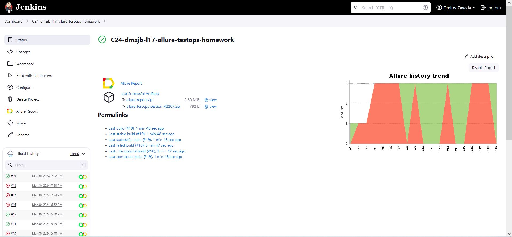
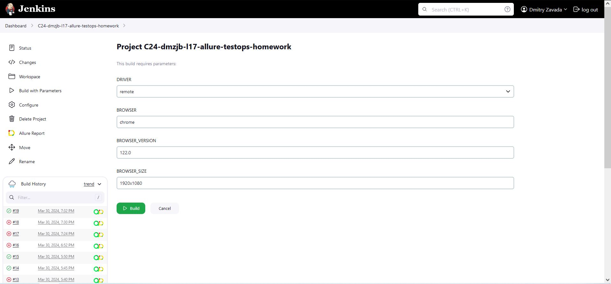
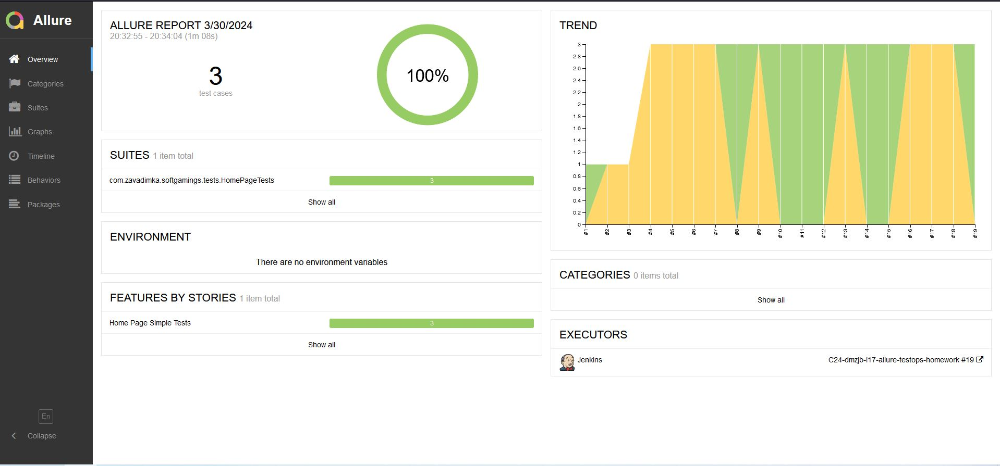
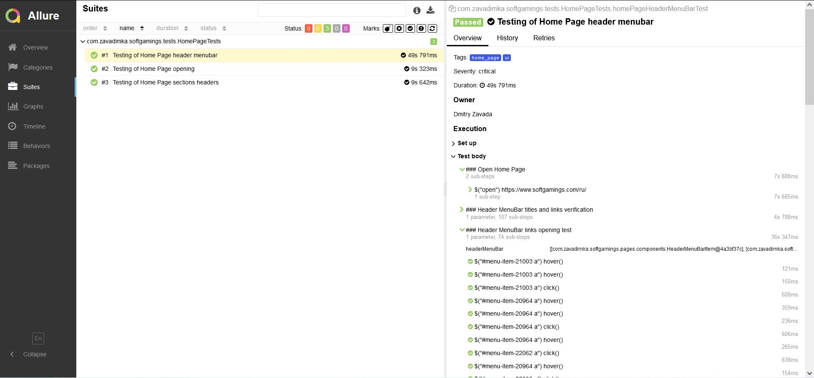
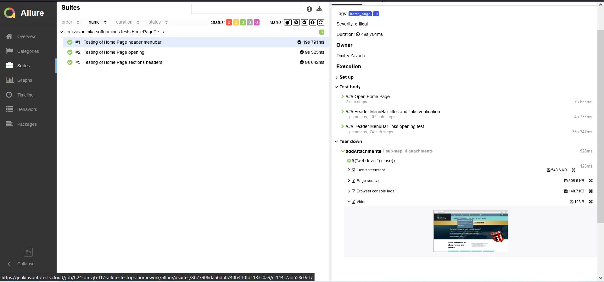
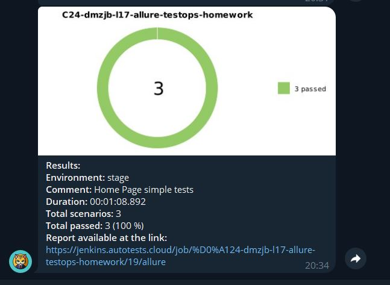
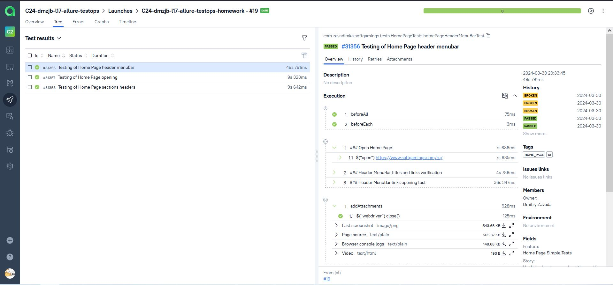
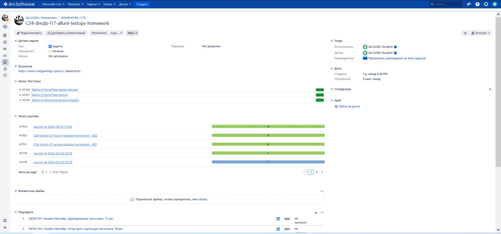
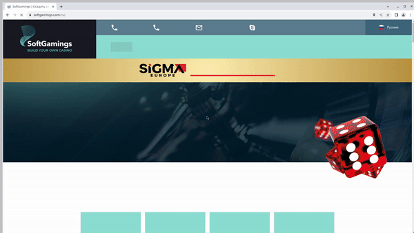

# Проект по тестированию русской версии [домашней страницы SoftGamings](https://www.softgamings.com/ru/)
В рамках набора простых автотестов проверяется фундаментальное поведение [домашней страницы SoftGamings](https://www.softgamings.com/ru/):
- [x] Корректная загрузка и проверка заголовка домашней страницы
- [x] Наличие важных разделов домашней страницы с правильными заголовками
- [x] Функциональность меню навигации по страницам, включая правильность заголовков, валидность и корректность открытия ссылок  


____
## :pushpin: Содержание

- <a href="#tools">Стек использованных технологий и инструментов</a>
- <a href="#start">Запуск тестов из командной строки</a>
- <a href="#jenkins">Jenkins. Непрерывный запуск тестов</a>
- <a href="#allure-report">Allure Report. Отчеты</a>
- <a href="#telegram">Telegram-бот. Уведомления</a>
- <a href="#allure-testops">Allure TestOps. Управление тестами</a>
- <a href="#jira">Jira. Выявление дефектов</a>
- <a href="#video">Selenoid. Видео запуска тестов</a>

____
<a id="tools"></a>
## :computer: Стек использованных технологий и инструментов

<p align="left">
    <a href="https://www.java.com/" target="_blank" rel="noreferrer">  </a> 
    <a href="https://git-scm.com/" target="_blank" rel="noreferrer">  </a> 
    <a href="https://gradle.org/" target="_blank" rel="noreferrer">  </a> 
    <a href="https://junit.org/junit5/" target="_blank" rel="noreferrer">  </a> 
    <a href="https://selenide.org/" target="_blank" rel="noreferrer">  </a> 
    <a href="https://aerokube.com/selenoid/" target="_blank" rel="noreferrer">  </a> 
    <a href="https://www.jenkins.io/" target="_blank" rel="noreferrer">  </a> 
    <a href="https://allurereport.org/" target="_blank" rel="noreferrer">  </a> 
    <a href="https://qameta.io/" target="_blank" rel="noreferrer">  </a> 
    <a href="https://www.atlassian.com/software/jira" target="_blank" rel="noreferrer">  </a> 
    <a href="https://telegram.org/" target="_blank" rel="noreferrer">  </a> 
    <a href="https://www.jetbrains.com/idea/" target="_blank" rel="noreferrer">  </a> 
</p>

- [x] Автотесты написаны на языке `Java`.  
- [x] В качестве системы контроля версий используется `Git`.  
- [x] Для тестирования использованы фреймворки `JUnit 5` и `Selenide`.  
- [x] Инструментом для сборки Java-проекта является `Gradle`.  
- [x] Управление удаленным браузером осуществляется с помощью `Selenoid`.  
- [x] Для непрерывного выполнения тестовых сценариев используется `Jenkins`:  
    - с помощью `cron-расписания` каждые 5 минут инициируется удаленное выполнение тестовых сценариев,  
    - по результатам автоматизированных тестов с помощью `Allure Report` генерируется отчет, оповещение с результатами тестов и ссылкой на отчет направляется в `Telegram-бот`.  
- [x] Для управления тестированием, отслеживания результатов и анализа данных используется `Allure TestOps`.  
- [x] Для управления проектом выполнена интеграция `Jira`.  

____
<a id="start"></a>
## :arrow_forward: Запуск тестов из командной строки
В проекте предусмотрено выполнение тестов локально и в удаленном браузере с помощью `Selenoid`, параметры драйвера передаются из соответствующего файла `properties`.

При выполнении команды тесты запустятся `удаленно` с помощью `Selenoid`:
```
gradle clean test
```

При выполнении команды тесты запустятся `локально`:
```
gradle clean test -Ddriver=local
```

После запуска теста на печать выводится информация о текущей конфигурации web-драйвера 


Параметры web-драйвера могут переопределены с помощью properties и параметров в `Jenkins`:
```
clean test
-Ddriver=${DRIVER}
-Dbrowser=${BROWSER}
-Dbrowser=${BROWSER_VERSION}
-Dbrowser=${BROWSER_SIZE}
```
Параметры сборки:

    DRIVER - локальный (local) или удаленный (remote) драйвер. По умолчанию - remote.
    BROWSER – браузер, в котором будут выполняться тесты. По умолчанию - chrome.
    BROWSER_VERSION – версия браузера, в котором будут выполняться тесты. По умолчанию - 122.0.
    BROWSER_SIZE – размер окна браузера, в котором будут выполняться тесты. По умолчанию - 1920x1080.

____
<a id="jenkins"></a>
## <a href="https://www.jenkins.io/" target="_blank" rel="noreferrer">  </a> Jenkins. Непрерывный запуск тестов

На сервере `Jenkins` создан **[job](https://jenkins.autotests.cloud/job/%D0%A124-dmzjb-l17-allure-testops-homework/)** для непрерывного запуска параметризованных автотестов.  

<p align="center">

</p>

Параметры теста:

<p align="center">

</p>

____
<a id="allure-report"></a>
## <a href="https://allurereport.org/" target="_blank" rel="noreferrer">  </a> Allure Report. Отчеты
По результатам каждого запуска автотестов генереруется аналогичный **[отчёт Allure Report](https://jenkins.autotests.cloud/job/%D0%A124-dmzjb-l17-allure-testops-homework/allure/#suites/8b77906daa6d50740b3ff0fd1183c0a9/5f4b72f0a117a9f/)**.  

<p align="center">

</p>

В отчёте подробно описаны шаги автотестов:  

<p align="center">

</p>

К отчёту также прикреплены вложения, в т.ч. видеозаписи автотестов:  

<p align="center">

</p>

____
<a id="telegram"></a>
## <a href="https://telegram.org/" target="_blank" rel="noreferrer">  </a> Telegram-бот. Уведомления
По результатам выполнения автотестов отправляется уведомление с помощью `Telegram-бота` с основной информацией и ссылкой на сгенерированный отчёт:  
<p align="center">

</p>

____
<a id="allure-testops"></a>
## <a href="https://qameta.io/" target="_blank" rel="noreferrer">  </a> Allure TestOps. Управление тестами
Для управления тестированием, отслеживания результатов и анализа данных выполнена интеграция сборки `Jenkins` в `Allure TestOps`:
<p align="center">

</p>

____
<a id="jira"></a>
##     <a href="https://www.atlassian.com/software/jira" target="_blank" rel="noreferrer">  </a> Jira. Выявление дефектов
Выполнена интеграция `Jira`. В задаче отражается информация  из Allure TestOps о результатах выполнения тестов и выявленных дефектах:
<p align="center">

</p>

____
<a id="video"></a>
## <a href="https://aerokube.com/selenoid/" target="_blank" rel="noreferrer">  </a> Selenoid. Видео запуска тестов
Выполнение каждого теста зафиксировано на видео в качестве вложения в отчет Allure Report:
<p align="center">
   
</p>